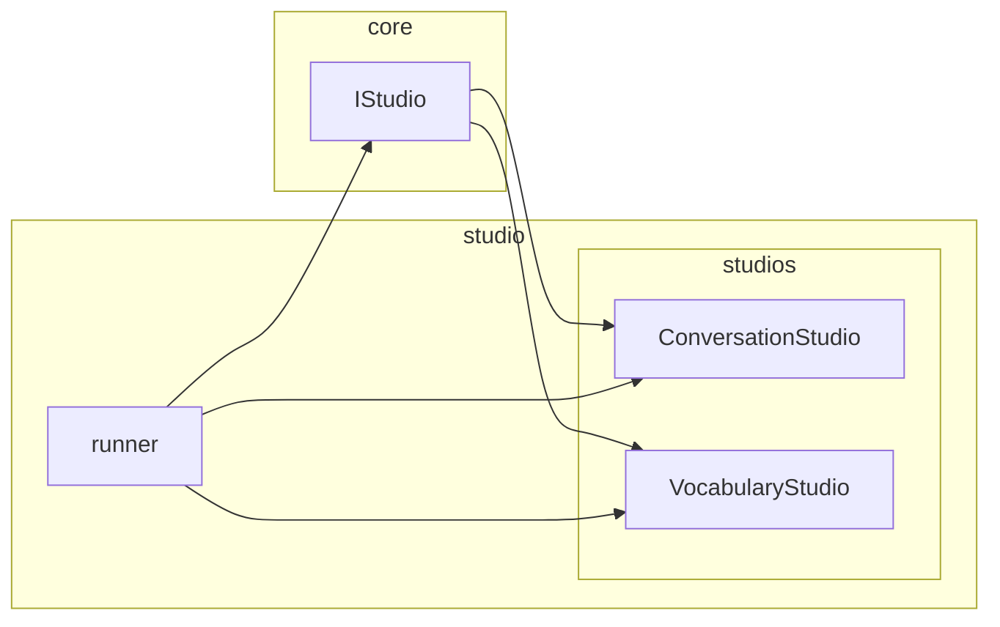

# 스튜디오 아키텍처 문서

LVPD Studio의 **스튜디오 인터페이스·러너·다중 스튜디오** 구조를 정리한 문서입니다.

---

## 1. 개요

- **목적**: 스튜디오 종류별로 "데이터 로드 / 이벤트 처리 / 그리기"만 구현하고, **창 생성·메인 루프·녹화**는 공통 러너가 담당하도록 분리.
- **효과**: 회화 스튜디오, 단어장 스튜디오 등을 같은 러너에 붙이고, 새 스튜디오 타입은 `IStudio` 구현 하나로 추가 가능.

---

## 2. 폴더 구조 (직관적 분리)

```
LVPD_Studio/
├── core/                    # 계약·인터페이스 (프레임워크 비의존)
│   └── interfaces.py        # IStudio, IVideoRenderer, IAudioMixer
│
├── studio/                  # 스튜디오 전용 (러너 + 구현체)
│   ├── __init__.py
│   ├── __main__.py          # python -m studio 진입점
│   ├── runner.py            # 공통 러너, StudioConfig, SimpleRecordingManager
│   └── studios/
│       ├── __init__.py
│       ├── conversation.py  # 회화 스튜디오
│       └── vocabulary.py    # 단어장 스튜디오 (스켈레톤)
│
├── data/                    # 데이터 로더·모델 (CSV 등)
├── audio/                   # 오디오 믹서
├── video/                   # 비디오 렌더러
├── utils/                   # 공용 유틸
├── docs/
└── main.py                  # 배치 파이프라인 진입점
```

| 폴더 | 역할 |
|------|------|
| **core** | 인터페이스만 정의. IStudio, IVideoRenderer, IAudioMixer 등. |
| **studio** | 스튜디오 러너 + 스튜디오 구현체(회화, 단어장 등). 창·루프·녹화·각 스튜디오 UI. |
| **data** | CSV/엑셀 로드, 모델. |
| **audio** / **video** / **utils** | 배치·렌더·공용 로직. |

---

## 3. 구조도



| 계층 | 역할 |
|------|------|
| **core** | `IStudio` 인터페이스만 정의 (pygame/녹화 비의존). |
| **studio** | 러너(runner) + 스튜디오 구현체(studios). 창·이벤트·그리기·녹화. |

---

## 4. core — IStudio 인터페이스

**파일**: `core/interfaces.py`

| 메서드 | 설명 |
|--------|------|
| `get_title() -> str` | 창 제목 (예: "LVPD Studio - 회화"). |
| `handle_events(events: list) -> bool` | pygame 이벤트 처리. `False` 반환 시 러너가 루프 종료. |
| `update() -> None` | 매 프레임 업데이트 (게이지, 애니메이션 등). |
| `draw(screen, config) -> None` | 화면에 그리기. `screen`: pygame.Surface, `config`: 해상도/좌표 등. |
| `get_recording_prefix() -> str \| None` | 녹화 파일명 접두사 (예: `REC_1`). 녹화 미사용 시 `None`. |
| `set_recording_request_callback(callback)` | (선택) R 키 등 녹화 요청 시 러너가 주입한 콜백. 기본 구현은 무시. |

---

## 5. studio — 러너 (runner.py)

**파일**: `studio/runner.py`

### 5.1 실행 모드 (debug / record)

| 모드 | 출력 | 녹화 | 목적 |
|------|------|------|------|
| **debug** | 화면에 직접 출력 | 없음 | 상태·타이밍·UI·인터랙션 테스트 |
| **record** | 화면 없음, 프레임 버퍼만 | 있음 (버퍼 → 인코더) | 최종 품질, deterministic, 프레임 정확성 |

- **디버그**: 창 생성, 이벤트 처리(QUIT/ESC/스튜디오), `draw(screen)` → `flip()`. R 키 녹화는 사용하지 않음.
- **녹화**: `SDL_VIDEODRIVER=dummy` 로 창 없이 초기화, 오프스크린 `Surface`에만 `draw(buffer)` 후 매 프레임 인코더로 전달. 종료는 `--record-duration`(초) 또는 `--record-frames`(프레임 수).

### 5.2 담당 역할

- `run(studio, mode="debug"|"record", record_duration=10.0, record_frames=None)`.
- **debug**: `pygame.init()` → 창 생성 → 메인 루프(이벤트, update, draw, flip). 녹화 없음.
- **record**: dummy 디스플레이 → 오프스크린 버퍼 → N초/N프레임만큼 draw → submit_frame → 인코딩.

### 5.3 공통 인프라 (러너 내 정의)

| 클래스 | 설명 |
|--------|------|
| **StudioConfig** | `width`, `height`, `fps`, `bg_color`, `get_pos(rx, ry)`, `get_size(rw, rh)`. |
| **SimpleRecordingManager** | `start(prefix, fps, size)`, `submit_frame(frame_rgb)`, `stop()`. 프레임 큐 + 스레드에서 opencv로 MP4 저장. |

---

## 5.5 렌더링 구조 (비디오·텍스트·이미지·UI)

목표는 **비디오만**이 아니라 **비디오 + 텍스트 + 이미지 + UI**를 한 화면에 모아서 그리는 것입니다. 현재는 두 경로가 있습니다.

### 배치 파이프라인 (main.py → video/renderer.py)

- **데이터**: `LoadedContent` = `video_segments`, `overlay_items`, `audio_tracks`.  
  각 프레임은 **(VideoSegment, OverlayItem)** 한 쌍으로 정의됨.
- **렌더링**: `IVideoRenderer.render_frame(timestamp_sec, segment=..., overlay=...)` 한 번 호출로  
  **한 장의 프레임**을 만듦.
  - `FFmpegSegmentOverlayRenderer`: FFmpeg `filter_complex`로  
    `[영상 -ss 시점] → scale → [이미지 오버레이] → [drawtext]` 순서로 합성 → raw RGB 반환.
- **레이어 순서 (아래→위)**  
  1. 베이스 영상 (VideoSegment 해당 시점 프레임, scale/pad)  
  2. 이미지 오버레이 (OverlayItem.image_path)  
  3. 텍스트 오버레이 (OverlayItem.text, position, font)

즉 배치는 **세그먼트·오버레이 단위로 “한 레이어 스택”**이 FFmpeg 한 번에 처리됩니다.

### 스튜디오 (studio/conversation/ draw())

- **데이터**: 회화 전용 CSV (video_path, sentence, translation 등).  
  `data.models`의 `VideoSegment`/`OverlayItem`과는 **다른 스키마**.
- **렌더링**: `draw(screen, config)` 안에서 **blit 순서**로 합성.
  1. `screen.fill(bg_color)`  
  2. `screen.blit(vid_surf, (0,0))` — 비디오 한 장  
  3. 문장/번역 텍스트 (font.render → blit)  
  4. 일시정지 라벨  
  5. 디버그 FPS 등
- **레이어 순서 (실제 그리기 순서)**  
  배경 → 비디오 → 자막/문장·번역 → UI(일시정지 등) → 디버그

즉 스튜디오는 **같은 “비디오 위에 텍스트·UI”** 개념이지만,  
배치의 `OverlayItem`(이미지·텍스트 위치/폰트)과 **공통 레이어 모델을 쓰지 않고** 각자 `draw()`에서 직접 그립니다.

### 통일된 레이어 모델 (권장)

비디오·텍스트·이미지·UI를 **한 구조로** 다루려면 아래처럼 **레이어 스택**으로 두는 것이 좋습니다.

| 순서 (아래→위) | 레이어 | 설명 | 배치 | 스튜디오 |
|----------------|--------|------|------|----------|
| 0 | 배경 | 단색 또는 비디오 전체 프레임 | FFmpeg base | fill + 비디오 blit |
| 1 | 이미지 오버레이 | 로고, 자막 배경 등 | OverlayItem.image_path | 현재 없음 (추가 가능) |
| 2 | 텍스트 오버레이 | 자막, 문장, 번역 | OverlayItem.text, position, font | 문장/번역 blit |
| 3 | UI | 일시정지, FPS, 버튼 등 | 없음 | 라벨·디버그 blit |

- **배치**: 이미 `VideoSegment + OverlayItem`으로 0→1→2까지 FFmpeg가 담당.  
- **스튜디오**:  
  - 0: 비디오 재생 프레임  
  - 1: (필요 시) 이미지 레이어  
  - 2: 텍스트(문장/번역)  
  - 3: UI(일시정지, FPS 등)  

나중에 스튜디오에서도 `OverlayItem` 같은 **공통 오버레이 모델**(텍스트 위치·폰트·이미지 경로)을 쓰고,  
`draw()`에서는 “레이어 리스트를 순서대로 그리기”만 하면 배치와 구조가 맞춰집니다.

### 요약

- **배치**: 비디오 + 텍스트 + 이미지를 **FFmpeg 한 번에** 렌더링 (세그먼트·오버레이 쌍).  
- **스튜디오**: 비디오 + 텍스트 + UI를 **pygame blit 순서**로 렌더링.  
- **통일**: “배경(비디오) → 이미지 → 텍스트 → UI” **레이어 스택**으로 두 경로를 같은 개념으로 맞추는 것이 좋음.

---

## 6. studio — 스튜디오 구현체 (studios/)

### 6.1 ConversationStudio (회화)

**패키지**: `studio/conversation/` (메인 클래스: `studio.py`)

- **데이터**: CSV 로드 (`_load_conversation_csv`). 컬럼: `topic`, `id`, `video_path`(또는 `video_root/topic/id.mp4`), `sentence`, `translation` (JSON 배열 가능).
- **비디오**: `SimpleVideoPlayer` (opencv → 프레임 캐시, 순차 read, FHD). 일시정지·되감기·앞으로 감기 지원.
- **비디오 사운드**: `VideoAudioPlayer` — ffmpeg로 비디오에서 오디오 추출(WAV) 후 `pygame.mixer.music`으로 재생. 일시정지/seek 시 비디오와 동기화.
- **별도 사운드**: `_play_sound(path)` — 효과음·나레이션 등 한 번 재생. `pygame.mixer.find_channel()`로 비디오 오디오와 별도 채널 사용.
- **키**: SPACE(다음 항목), P(일시정지), **Home/R(처음으로 되감기 후 재생)**, ←/J(뒤로 5초), →/L(앞으로 5초), B/←이전(이전 항목).
- **그리기**: 비디오 → 문장/번역 텍스트 → 일시정지 라벨 → 디버그 FPS.
- **녹화**: `get_recording_prefix()` → `REC_{id}`.

#### 6.1.1 렌더링 최적화

- **비디오**: seek 최소화(순차 read), 프레임 캐시(같은 비디오 프레임은 재사용), OpenCV 리사이즈 + `pygame.image.frombuffer`(surfarray 제거), FHD 디코딩 고정.
- **실제 dt**: `config.dt_sec`으로 재생 시간 진행해 프레임 드랍 시에도 PTS는 실시간에 가깝게 유지.

#### 6.1.2 오디오·비디오 제어

- **비디오**: 중간에 **일시정지(P)**, **되감기(←/J 5초, Home/R은 처음으로)** 지원. `seek_to(0)` 후 재생으로 “다시 처음부터” 가능.
- **비디오 사운드**: 소스 변경 시 ffmpeg로 해당 영상에서 오디오만 추출 후 재생. seek/일시정지 시 `pygame.mixer.music`으로 동기화.
- **별도 사운드**: `_play_sound(path)`로 효과음/나레이션 재생. 비디오 오디오와 별도 채널이라 동시 재생 가능.

### 6.2 VocabularyStudio (단어장)

**파일**: `studio/studios/vocabulary.py`

- **역할**: 연동 구조 검증용 **스켈레톤**.
- **데이터**: 없음 (빈 리스트/더미 확장 가능).
- **그리기**: 배경 + "단어장 스튜디오 (스켈레톤)" 한 줄 텍스트.
- **녹화**: `get_recording_prefix()` → `None`.

---

## 7. 메인 루프 흐름 (러너)

**디버그 모드:**
```
pygame.init()
screen = pygame.display.set_mode(...)
while running:
    events = pygame.event.get()
    → QUIT/ESC면 종료
    → studio.handle_events(events)
    studio.update()
    studio.draw(screen, config)
    pygame.display.flip()
    clock.tick(config.fps)
pygame.quit()
```

**녹화 모드:**
```
SDL_VIDEODRIVER=dummy → pygame.init()
pygame.display.set_mode((1,1))
buffer = Surface(w, h)
recorder.start(...)
for _ in range(record_frames or duration*fps):
    studio.update()
    studio.draw(buffer, config)
    submit_frame(buffer → numpy)
    clock.tick(fps)
recorder.stop()
pygame.quit()
```

---

## 8. 진입점·실행 방법

| 목적 | 명령 |
|------|------|
| **디버그 (화면만)** | `python -m studio --studio conversation --csv <경로>` 또는 `--mode debug` (기본) |
| **녹화 (오프스크린만)** | `python -m studio --mode record --studio conversation --csv <경로> [--record-duration 10]` 또는 `--record-frames 300` |
| **단어장 스튜디오** | `python -m studio --studio vocabulary` |

- **옵션**: `--mode debug`(기본) / `--mode record`, `--record-duration N`(초), `--record-frames N`(지정 시 duration 무시).
- **환경 변수**: `CONTENT_CSV_PATH`로 CSV 경로 지정 가능 (conversation 시 `--csv` 대체).
- **의존성**: pygame 필수. record 모드에서 numpy·opencv-python 권장.

---

## 9. 새 스튜디오 추가 방법

1. **`studio/studios/` 아래에 새 모듈 추가** (예: `my_studio.py`).
2. **`IStudio` 구현**  
   - `get_title()`, `handle_events()`, `update()`, `draw(screen, config)`, `get_recording_prefix()` 구현.
3. **러너에 등록**  
   - `studio/runner.py`의 `_create_studio()`에 이름 → 클래스 매핑 추가.  
   - `argparse`의 `--studio` choices에 새 이름 추가.

이렇게 하면 동일 러너로 새 스튜디오를 실행할 수 있습니다.

---

## 10. 참고

- **배치 파이프라인**: `main.py`는 CSV → 렌더 → mux → output 배치 전용이며, 스튜디오와 별개입니다.
- **스튜디오 진입점**: `python -m studio` (또는 `studio/__main__.py` → `studio.runner.main()`).
