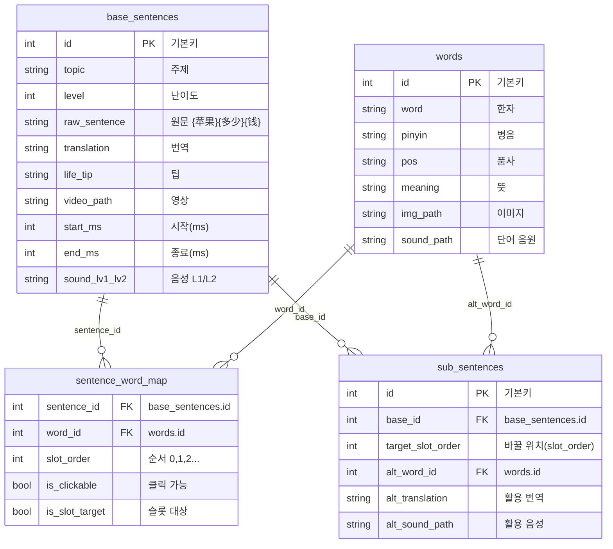

# 테이블 구조

현재 앱: **base_sentences**, **words**, **sub_sentences**, **sentence_word_map** 4개 테이블.  
슬롯(활용 문장)은 **sub_sentences** 테이블로 관리 (base_id, target_slot_order, alt_word_id, alt_translation, alt_sound_path).

---

## 현재 테이블 구조도



**관계 요약**

| 관계 | 설명 |
|------|------|
| base_sentences → sentence_word_map | 한 문장에 단어들이 **순서(slot_order)** 로 배치됨 |
| words → sentence_word_map | 단어가 여러 문장에서 재사용됨 |
| base_sentences → sub_sentences | 한 base당 **활용 문장** 여러 개 (슬롯 대체) |
| words → sub_sentences | 활용 시 **대체 단어(alt_word_id)** 로 words 참조 |

**재생 시**: base 1개 → 해당 base_id의 sub_sentences만큼 “활용” 페이지가 추가됨. 활용 문장은 base 문장에서 `target_slot_order` 위치 단어를 `alt_word_id` 단어로 바꾼 문장 + `alt_translation`.

### 텍스트 구조도 (ASCII)

```
┌─────────────────────┐       ┌──────────────────────────┐
│   base_sentences     │       │   sentence_word_map       │
├─────────────────────┤       ├──────────────────────────┤
│ id (PK)              │◄──────│ sentence_id (FK)         │
│ topic                │       │ word_id (FK) ──────────────┼───►┌──────────┐
│ raw_sentence         │       │ slot_order (0,1,2...)     │    │  words   │
│ translation          │       │ is_clickable              │    ├──────────┤
│ video_path, sound…   │       │ is_slot_target            │    │ id (PK)  │
└──────────┬──────────┘       └──────────────────────────┘    │ word     │
           │                                                    │ pinyin   │
           │ 1:N                                                │ meaning  │
           ▼                                                    └────┬─────┘
┌─────────────────────┐                                              │
│   sub_sentences     │                                              │ alt_word_id
├─────────────────────┤       base_id ──► base_sentences.id          │
│ id (PK)             │       target_slot_order (slot_order와 대응)   │
│ base_id (FK) ───────┼──► base_sentences                            │
│ target_slot_order   │       alt_word_id (FK) ──────────────────────┘
│ alt_word_id (FK) ───┼──► words
│ alt_translation     │
│ alt_sound_path      │
└─────────────────────┘
```

---

## 1. words (단어 테이블)

**경로**: `resource/table/words.xlsx` → `resource/csv/words.csv`  
**용도**: 단어 카드 표시, 병음·뜻 조회

| 컬럼 | 타입 | 필수 | 설명 |
|------|------|------|------|
| id | int | O | 기본키 |
| word | str | O | 한자 단어 |
| pinyin | str | - | 병음(성조) |
| pos | str | - | 품사. 복수 시 `\|` 구분 |
| meaning | str | - | 뜻. pos 순서와 대응 |
| img_path | str | - | 이미지 경로 |
| sound_path | str | - | 단어 발음 음원 |

---

## 2. base_sentences (문장·영상 테이블)

**경로**: `resource/table/base_sentences.xlsx` → `resource/csv/base_sentences.csv`

| 컬럼 | 타입 | 필수 | 설명 |
|------|------|------|------|
| id | int | O | 기본키 |
| topic | str | - | 주제 |
| level | int | - | 난이도 |
| raw_sentence | str | O | 원문 (예: {苹果}{多少}{钱}) |
| translation | str | - | 번역 |
| life_tip | str | - | 팁 |
| video_path, start_ms, end_ms, sound L1/L2 등 | - | - | 미디어 |

---

## 3. sub_sentences (슬롯·활용 문장)

**경로**: `resource/table/sub_sentences.xlsx` → `resource/csv/sub_sentences.csv`  
**역할**: 한 base 문장에 대한 “슬롯별 대체” — 특정 위치(target_slot_order)의 단어를 alt_word로 바꾼 문장·번역.

| 컬럼 | 타입 | 설명 |
|------|------|------|
| id | int | 기본키 |
| base_id | int | base_sentences.id |
| target_slot_order | int | 바꿀 단어 위치 (0부터, sentence_word_map의 slot_order와 대응) |
| alt_word_id | int | 대체 단어 (words.id) |
| alt_translation | str | 해당 활용 문장의 번역 |
| alt_sound_path | str | 활용 문장 음성(선택) |

재생 시: base 1개 + 해당 base_id의 sub_sentences 목록만큼 “활용” 페이지가 추가됨.

---

## 4. sentence_word_map

문장별 단어 배치 (sentence_id, word_id, slot_order, is_clickable, is_slot_target).

---

## 5. 데이터 흐름

```
resource/table/*.xlsx (base_sentences, words, sub_sentences, sentence_word_map)
    → create_all_csv.bat / python -m tools.csv_gen
    → resource/csv/*.csv
    → data.table_manager 로드 후 get_table_rows() / get_loaded_content()
```

---

## 6. 관련 파일

| 파일 | 역할 |
|------|------|
| [data/table_manager.py](data/table_manager.py) | 4개 CSV 로드, get_table_rows, get_sub_sentences_for_base, get_word 등 |
| [tools/csv_gen](tools/csv_gen) | 엑셀 → 테이블 CSV |
