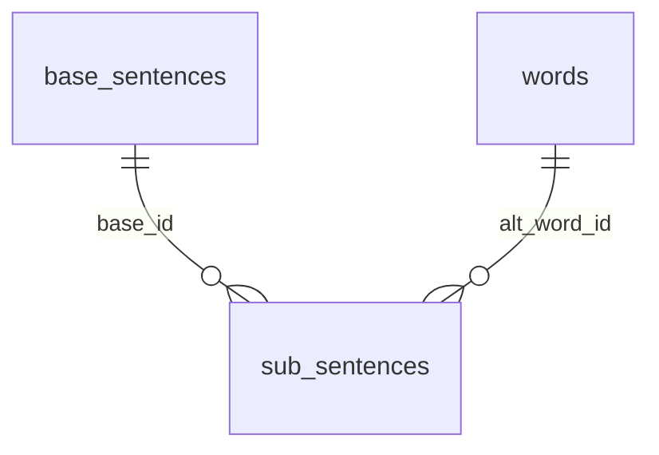

# 테이블 구조 (3테이블)

회화 데이터는 아래 3개 CSV를 기준으로 운영합니다.

- `base_sentences.csv`
- `words.csv`
- `sub_sentences.csv`

`sentence_word_map.csv`는 신규 기본 경로에서 사용하지 않습니다(레거시 폴백 전용).

---

## 1) words (필수)

**경로**: `resource/table/words.xlsx` → `resource/csv/words.csv`

| 컬럼 | 타입 | 필수 | 설명 |
|------|------|------|------|
| id | int | O | 단어 ID |
| word | str | O | 한자 단어 |
| pos | str | - | 품사 |
| meaning | str | - | 뜻 |
| img_path | str | - | 이미지 경로 |

---

## 2) base_sentences

**경로**: `resource/table/base_sentences.xlsx` → `resource/csv/base_sentences.csv`

| 컬럼 | 타입 | 필수 | 설명 |
|------|------|------|------|
| id | int | O | 문장 ID |
| topic | str | - | 주제 |
| raw_sentence | str | O | 원문(예: `{苹果}{多少}{钱}？`) |
| translation | str | - | 번역 |
| video_path | str | - | 영상 경로 |
| video_start_ms | int | - | 시작(ms) |
| video_end_ms | int | - | 종료(ms) |
| sound_lv1_path | str | - | L1 음성 |
| sound_lv2_path | str | - | L2 음성 |
| base_words | str | O | 기본 단어 순서(`|` 구분, 예: `苹果|多少|钱`) |

---

## 3) sub_sentences

**경로**: `resource/table/sub_sentences.xlsx` → `resource/csv/sub_sentences.csv`

| 컬럼 | 타입 | 필수 | 설명 |
|------|------|------|------|
| id | int | O | 서브 문장 ID |
| base_id | int | O | `base_sentences.id` |
| target_slot_order | int | O | 교체할 단어 위치(0 시작) |
| alt_word_id | int | O | 대체 단어 ID(`words.id`) |
| alt_translation | str | - | 대체 문장 번역 |
| alt_sound_path | str | - | 대체 문장 음성 경로 |

---

## 관계 요약

- 기본 문장 단어 순서는 `base_sentences.base_words`에서 관리합니다.
- 활용 문장은 `sub_sentences.target_slot_order` 위치를 `alt_word_id`로 교체해 생성합니다.

---

## 운영 규칙

- ID 일관성: `sub_sentences.base_id == base_sentences.id`
- 단어 순서 기준: `base_words`는 `raw_sentence`의 슬롯 순서와 일치
- 사람 편집 우선: 필요한 컬럼만 유지하고 추가 메타 컬럼은 넣지 않음
