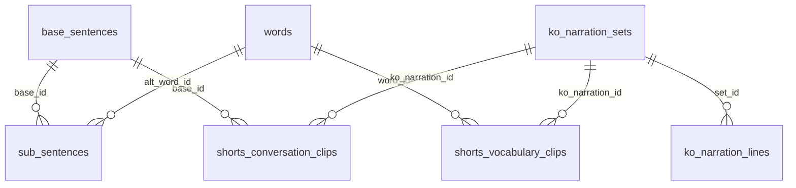

# 테이블 구조

회화 데이터는 아래 3개 CSV를 기준으로 운영합니다.

- `base_sentences.csv`
- `words.csv`
- `sub_sentences.csv`

숏츠 스튜디오는 회화·단어용 CSV를 **각각** 사용합니다(`shorts_conversation_clips.csv`, `shorts_vocabulary_clips.csv`).

한국어 TTS·자막은 전용 테이블 `ko_narration_sets.csv`, `ko_narration_lines.csv`에 문장을 넣고, 숏츠 CSV의 `ko_narration_id`로 세트를 참조합니다.

`sentence_word_map.csv`는 신규 기본 경로에서 사용하지 않습니다(레거시 폴백 전용).

**통합 배치**: 프로젝트 루트 `lvpd.bat` (CSV / TTS / 녹화·실행 / 오디오 추출 / 한자 프레임). 호환: `create_all_csv.bat`, `batch_tts.bat`, `record_output_select_mode.bat` 등.

**CSV 일괄 생성**: `lvpd.bat csv` 또는 `create_all_csv.bat` → `python -m tools.csv_gen` (위 테이블 엑셀→CSV 포함).

---

## 1) words (필수)

**경로**: `resource/table/words.xlsx` → `resource/csv/words.csv`

| 컬럼 | 타입 | 필수 | 설명 |
|------|------|------|------|
| id | int | O | 단어 ID |
| word | str | O | 한자 단어 |
| pos | str | - | 품사 |
| meaning | str | - | 뜻 |
| tip | str | - | 학습 팁(숏츠 단어 모드: tip 줄) |
| tts_type | str | - | 숏츠 **뜻 TTS** 엔진: `edge` \| `gtts`. 비우면 `edge` |
| tts_voice | str | - | Edge 목소리 ID (예: `ko-KR-SunHiNeural`). `gtts`는 무시 |
| img_path | str | - | 이미지 경로 |
| video_path | str | - | 연상 동영상 (숏츠 단어 모드, 있으면 이미지 대신 재생) |
| sound_path | str | - | 단어 발음 음원 |

---

## 2) base_sentences

**경로**: `resource/table/base_sentences.xlsx` → `resource/csv/base_sentences.csv`

| 컬럼 | 타입 | 필수 | 설명 |
|------|------|------|------|
| id | int | O | 문장 ID |
| topic | str | - | 주제 |
| raw_sentence | str | O | 원문(예: `{苹果}{多少}{钱}？`) |
| translation | str | - | 번역 |
| video_path | str | - | 영상 경로 |
| video_start_ms | int | - | 시작(ms) |
| video_end_ms | int | - | 종료(ms) |
| sound_lv_path | str | - | 음성 |

---

## 3) sub_sentences

**경로**: `resource/table/sub_sentences.xlsx` → `resource/csv/sub_sentences.csv`

| 컬럼 | 타입 | 필수 | 설명 |
|------|------|------|------|
| id | int | O | 서브 문장 ID |
| base_id | int | O | `base_sentences.id` |
| target_slot_order | str | O | 슬롯 위치. **정수**면 해당 슬롯 통째 교체, **소수**(예 `1.1`)면 정수 부분 슬롯 **직후**에 삽입. 파이프로 다중 지정(`0\|0.1\|0.2`). 자세한 규칙은 `docs/slot_format_guide.md` §3.1 |
| alt_word_id | int | O | 대체 단어 ID(`words.id`) |
| alt_translation | str | - | 대체 문장 번역 |
| alt_sound_path | str | - | 대체 문장 음성 경로 |

---

## 4) shorts_conversation_clips (숏츠·회화)

**경로**: `resource/table/shorts_conversation_clips.xlsx` → `resource/csv/shorts_conversation_clips.csv`

| 컬럼 | 타입 | 필수 | 설명 |
|------|------|------|------|
| id | int | O | 숏츠 클립 ID |
| topic | str | - | 주제 (`--topic` 필터) |
| base_id | int | O | `base_sentences.id` |
| hook_title | str | O | 상단 후킹 타이틀 |
| hook_image_path | str | - | 판다 이미지. 비우면 `resource/image/shorts/panda/conversation/{id}.png` 등 |
| situation_subtitle | str | - | 하단 상황 설명(비우면 base 번역) |
| ko_narration_id | int | - | `ko_narration_sets.id` 참조. 비우면 한국어 내레이션 없음 |
| syllable_times_ms | str | - | 노래방 타이밍(ms, 쉼표). 비우면 균등 분할 |
| sound_path | str | - | 비우면 base `sound_lv_path` |
| last_hold_text | str | - | 클립 종료 **CTA_HOLD** 구간 문구. tip 없으면 TTS·비디오 자막 앵커 아래. `\\n` 줄바꿈 |
| last_hold_sec | float | - | CTA_HOLD 대기 시간(초, 소수 가능). 비우면 **2.5** |

## 5) shorts_vocabulary_clips (숏츠·단어)

**경로**: `resource/table/shorts_vocabulary_clips.xlsx` → `resource/csv/shorts_vocabulary_clips.csv`

| 컬럼 | 타입 | 필수 | 설명 |
|------|------|------|------|
| id | int | O | **topic당 1개** (CSV 행 id) |
| topic | str | - | 주제 (`--topic` 필터) |
| word_id | str | O | `words.id` 여러 개: `20501\|20504\|20505` (`\|` 구분) |
| hook_title | str | O | 훅 문구: `\|` 로 복수. **1개만** 넣으면 모든 단어에 동일 |
| ko_narration_id | int | - | topic 인트로 TTS·자막 (`batch_tts.bat` 2 또는 `batch_ko_tts.bat`) |
| video_path | str | - | topic 인트로 mp4 1개 |
| sound_repeat_count | str | - | 중국어 `sound_path` 재생 횟수. `1` 또는 `2\|1\|1` (`word_id` 순, 1개면 전체 동일). 기본 1 |
| after_sound_delay_sec | str | - | 마지막 mp3 재생 후 다음 단어까지 대기(초). `1.5` 또는 `2\|1\|0.5` 형식. 기본 0 |
| read_meaning_ko | str | - | 뜻 한국어 TTS 재생 여부. `true`/`false` 또는 `true\|false\|true` (`word_id` 순, 1개면 전체 동일). 기본 `true`. `false`면 뜻 나레이션 생략 후 바로 중국어 `sound_path` mp3 |
| last_hold_text | str | - | **topic 전체** 마지막 단어 종료 후 CTA_HOLD 문구 — words.csv `tip` 아래. `\\n` 줄바꿈 |
| last_hold_sec | float | - | CTA_HOLD 대기(초, 소수 가능). 비우면 **2.5** |

단어 숏츠는 `syllable_times_ms` 없음(노래방은 발음 길이로 균등 진행). 회화 숏츠만 `syllable_times_ms` 사용.

로드 시 단어 클립 내부 id는 `{id}001`, `{id}002` … (예: topic id=1 → 1001, 1002). 판다: `panda/vocabulary/{내부id}.png`.

**재생**: (1회) topic 비디오 + 인트로 TTS → 단어마다 훅 → (`read_meaning_ko`) 뜻 TTS → 중국어 발음(`sound_repeat_count`회) → `after_sound_delay_sec` 대기 → 다음 단어 → (마지막) **CTA_HOLD** + `last_hold_text`.

### CSV 예 (topic 1행)

```csv
id,topic,word_id,hook_title,ko_narration_id,video_path,sound_repeat_count,after_sound_delay_sec,read_meaning_ko
1,fruit_store,20501|20504|20505,사과 외워보세요|망고 외워보세요|수박 외워보세요,2,resource/video/intro.mp4,2|2|1,1.5|1|0.5,true
```

`hook_title`이 `과일 단어 외워보세요` 한 줄이면 사과·망고·수박 모두 같은 훅.

준비: `lvpd.bat` → `2` TTS(회화 set_id) → `1` TTS(단어 id/topic) → F5 `--topic …`. CLI: `lvpd.bat tts 2 1000`, `lvpd.bat tts 1 id 1`, `lvpd.bat run shorts_vocabulary bao`

## 6) ko_narration_sets (한국어 TTS·세트)

**경로**: `resource/table/ko_narration_sets.xlsx` → `resource/csv/ko_narration_sets.csv`

| 컬럼 | 타입 | 필수 | 설명 |
|------|------|------|------|
| id | int | O | 내레이션 세트 ID (`shorts_*_clips.ko_narration_id`가 참조) |
| title | str | - | 메모·제목 |
| srt_path | str | - | (선택) 세트 전체 SRT. 있으면 `ko_narration_lines` 대신 사용 |

## 7) ko_narration_lines (한국어 TTS·문장)

**경로**: `resource/table/ko_narration_lines.xlsx` → `resource/csv/ko_narration_lines.csv`

| 컬럼 | 타입 | 필수 | 설명 |
|------|------|------|------|
| id | int | O | 문장 행 ID |
| set_id | int | O | `ko_narration_sets.id` |
| seq | int | O | 재생 순서(오름차순) |
| text | str | O | 한국어 문장 1줄 (TTS·자막 1큐) |

**배치 TTS**: `python main.py batch-shorts-ko --topic where`  
→ `resource/sound/ko_set_{set_id}_{n}.mp3`, `resource/sound/ko_set_{set_id}_timeline.json`

---

## 관계 요약


```mermaid
erDiagram
    base_sentences ||--o{ sub_sentences : "base_id"
    base_sentences ||--o{ shorts_conversation_clips : "base_id"
    words ||--o{ shorts_vocabulary_clips : "word_id"
    words ||--o{ sub_sentences : "alt_word_id"
    ko_narration_sets ||--o{ ko_narration_lines : "set_id"
    ko_narration_sets ||--o{ shorts_conversation_clips : "ko_narration_id"
    ko_narration_sets ||--o{ shorts_vocabulary_clips : "ko_narration_id"
```

- 기본 문장 단어 순서는 `raw_sentence`의 슬롯(`{}`)에서 추출합니다.
- 활용 문장은 `sub_sentences.target_slot_order`와 `alt_word_id`로 조합한다. 정수 슬롯은 **교체**, 소수 슬롯은 해당 정수 슬롯 **뒤에 삽입**한다(`slot_format_guide.md` 참고).

---

## 운영 규칙

- ID 일관성: `sub_sentences.base_id == base_sentences.id`
- 단어 순서 기준: `raw_sentence`의 슬롯 순서를 그대로 사용
- 사람 편집 우선: 필요한 컬럼만 유지하고 추가 메타 컬럼은 넣지 않음
